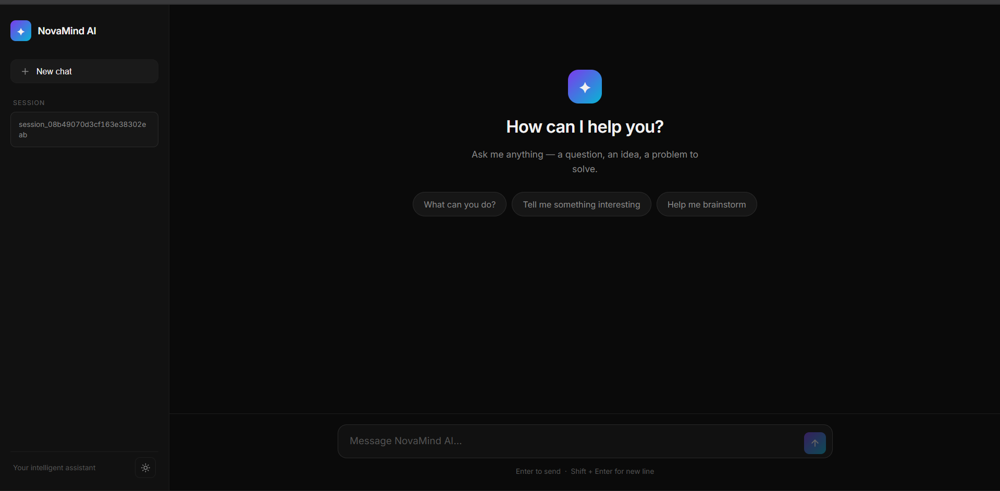
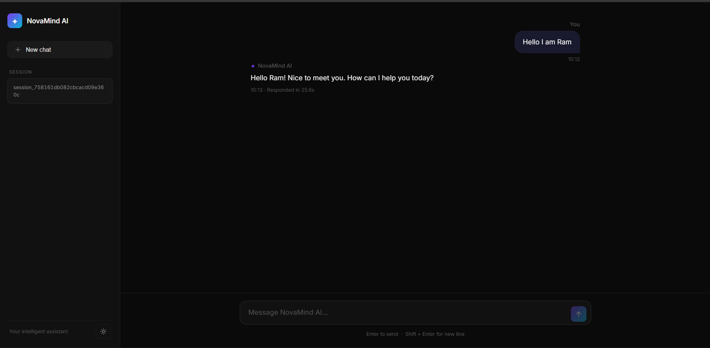

# NovaMind AI — AI Chatbot (Spring Boot)

A full-stack AI chatbot built with Java and Spring Boot, powered by Google Gemini.
Features a clean chat UI with conversation memory and session management.

## Screenshots

### Empty State


### Active Conversation


## Tech Stack

- Java 21
- Spring Boot 4.1.0
- Spring AI 2.0.0
- Google Gemini (gemini-3.8-flash)
- In-memory conversation history (MessageWindowChatMemory)

## Project Structure

src/main/java/project/chatbot/
├── ChatbotApplication.java
├── controller/
│ ├── Chat_Controller.java
│ ├── ChatRequest.java
│ └── ChatResponse.java
├── service/
│ └── ChatService.java
├── exception/
│ ├── GlobalExceptionHandler.java
│ └── ErrorResponse.java
└── config/
└── AppConfig.java

src/main/resources/
├── application.properties ← gitignored, add your API key here
├── application.properties.example
└── static/
└── index.html ← frontend chat UI


## Setup

1. Clone the repo
2. Copy the example properties file:

cp src/main/resources/application.properties.example src/main/resources/application.properties

3. Get a free Gemini API key from https://aistudio.google.com/apikey
4. Add your key in `application.properties`:

spring.ai.google.genai.api-key=YOUR_KEY_HERE

5. Run the app:

mvn spring-boot:run

6. Open http://localhost:8080 in your browser

## API Contract

### Send a message

POST /api/chat?sessionId={sessionId}
Content-Type: application/json

{
"message": "Hello"
}


### Success Response
```json
{
  "message": "Hello! How can I help you?",
  "sessionId": "session_abc123",
  "requestTime": "2026-10-06T09:00:00",
  "responseTime": "2026-10-06T09:00:02"
}
```

### Error Response
```json
{
  "status": 500,
  "error": "Something went wrong: ...",
  "path": "/api/chat",
  "timestamp": "2026-10-06T09:00:00"
}
```

## Features

- Chat UI served at http://localhost:8080
- Conversation memory — the AI remembers context within a session
- Each new chat generates a unique session ID
- Request and response timestamps shown in the UI
- Light and dark theme toggle
- Error handling with structured error responses
- GitHub Actions CI pipeline

## What I learned building this

- Spring Boot REST API design
- Spring AI integration with Google Gemini
- Conversation memory with MessageWindowChatMemory
- DTO pattern for clean request and response handling
- Global exception handling with @RestControllerAdvice
- Serving a frontend from Spring Boot static resources
- Git branching, PR workflow, and GitHub Actions CI